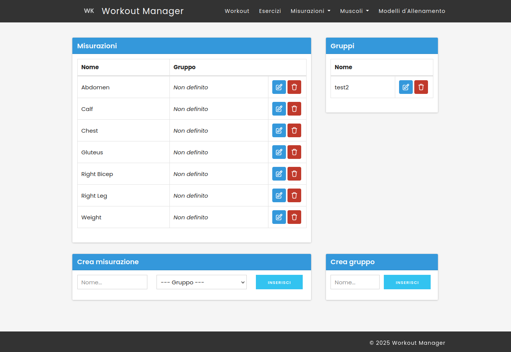

# 🏋️‍♂️ Workout Manager

<p align="center">
  
</p>

Workout Manager è un'applicazione web semplice e modulare per la gestione degli allenamenti, sviluppata in PHP con MySQL, HTML, CSS e JavaScript.

## 🚀 Funzionalità

- Gestione di workout, esercizi e gruppi muscolari
- Interfaccia web semplice e minimale
- Organizzazione in stile MVC (senza framework esterni)
- Routing personalizzato
- Database relazionale

## 📦 Requisiti

- PHP >= 7.4
- MySQL (o MariaDB)
- Server Web (Apache, Nginx, ecc.)
- Composer (facoltativo)

## 🛠️ Installazione

1. Clona il repository

```bash
git clone https://github.com/TommyB1992/workout-manager.git
cd workout-manager
```

2. Crea il database e importa lo schema

```bash
mysql -u TUO_UTENTE -p
> CREATE DATABASE workout_manager;
> exit
mysql -u TUO_UTENTE -p workout_manager < scripts/schema.sql
```

3. Configura la connessione al database

Modifica `config/database.php` con i parametri corretti:

```php
return [
    'host' => 'localhost',
    'dbname' => 'workout_manager',
    'user' => 'TUO_UTENTE',
    'password' => 'TUA_PASSWORD',
];
```

4. Configura il server web

Imposta il document root su `public/`.  

5. (Opzionale) Avvia un server PHP locale

```bash
php -S localhost:8000 -t public
```

Apri il browser su: http://localhost:8000

## 👤 Autore

**Tomas Bartoli**  
GitHub: [@TommyB1992](https://github.com/TommyB1992)

## 📝 Licenza

Distribuito con licenza MIT.
